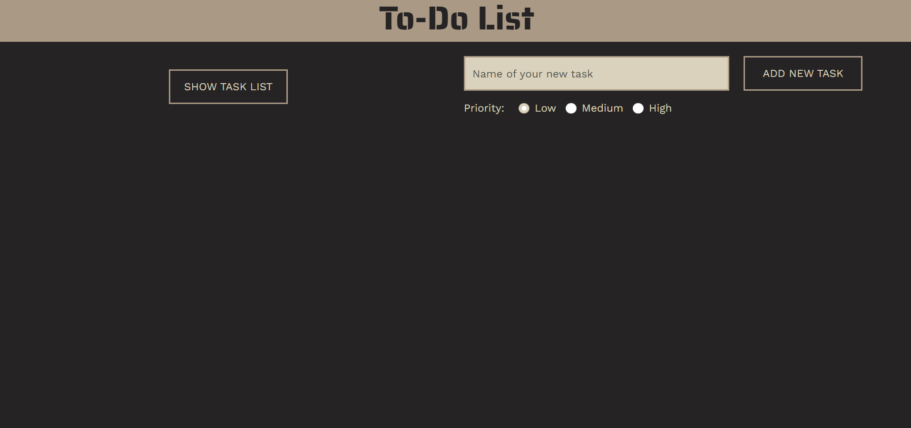
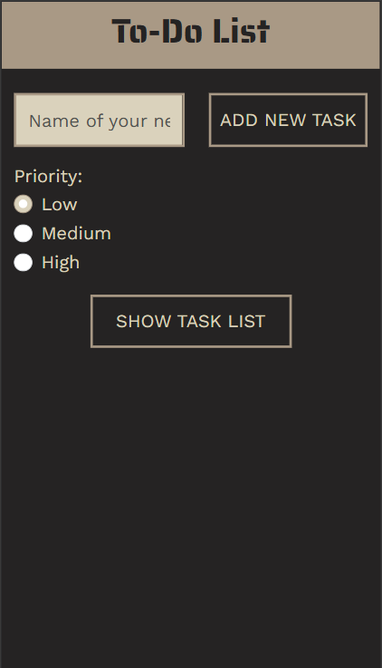
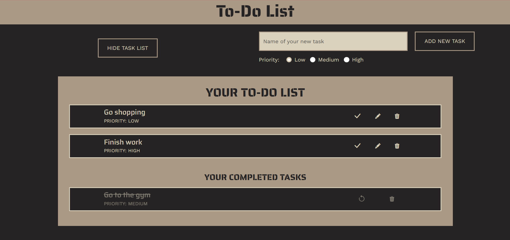
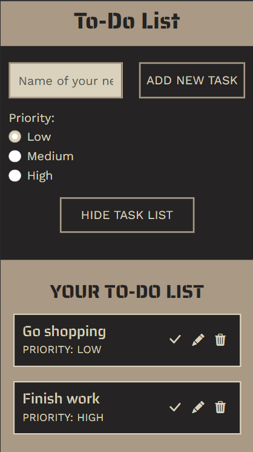
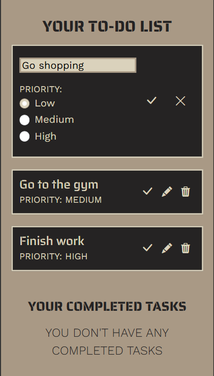

# TO-DO LIST WEB APP
### Vanessa Nicolì

---

## About me
Junior Front-End Developer con background in *Informatica e Comunicazione Digitale*.  
Creo interfacce web responsive e user-friendly utilizzando HTML, CSS, Bootstrap e JavaScript.  
Mi concentro su UI pulite, accessibilità e esperienza utente.

---

## Tech Stack
- HTML5
- CSS3
- Bootstrap 5
- JavaScript

---

## Features
- Create, edit and delete tasks  
- Mark tasks as completed and restore them  
- Responsive layout (mobile-first design)

---

## Preview

### Home (Desktop)


### Home (Mobile)


### Task List (Desktop)


### Task List (Mobile)


### Edit (Mobile)


---

## Live Demo
Link: [To-Do List](https://todo-vn.netlify.app/)

---

## Project Structure

```text
todo
  ├── index.html
  ├── css/
  │   └── style.css 
  ├── js/
  │   └── main.js 
  ├── assets/
  │   └── images/
  │       └── preview/
  │           └── preview-home-web.png
  │           └── preview-home-mobile.png
  │           └── preview-list-web.png
  │           └── preview-list-mobile.png
  │           └── preview-edit-mobile.png
  ├── .gitignore
  └── README.md
```

---

## Project Goal

L’obiettivo del progetto è esercitarmi nello sviluppo di una To-Do List in JavaScript, migliorando la manipolazione del DOM e la gestione delle interazioni utente in un’interfaccia responsive.

---

## Contact
Email: nicoli.vanessa1996@gmail.com  
LinkedIn: https://www.linkedin.com/in/vanessa-nicol%C3%AC/  
GitHub: https://github.com/vanessanicoli

---

## Future improvements
- Ordinamento dei task per nome o priorità
- Filtro dei task (completati / non completati)